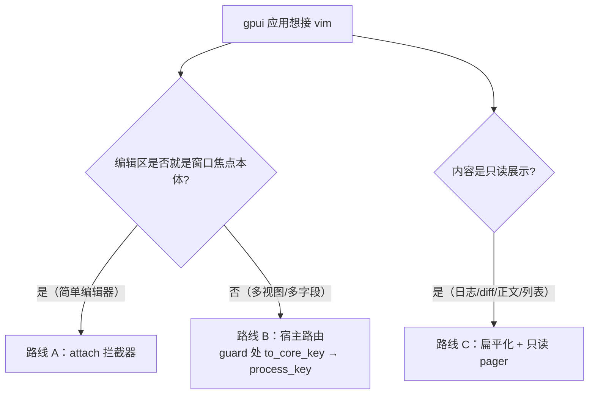

# 三仓协作设计：gpui_vim × PandaGit × PandaMail

> 依据：doc-poste `gpui-vim/assessment.mdx` 的实用性评估（2026-09），加两轮对
> pandagit / pandamail 仓库的现状盘点。本文回答一个问题：**接下来三个仓库各
> 自做什么、按什么顺序、怎么验收**。引擎内部的语义约束见 ROADMAP「全局不变
> 量」，本文不重复；本文的任务全部属于「组件层」，动手前同样先读不变量。
>
> **进展（2026-09-17）**：阶段 0（INTEGRATION.md 三模式决策文档）、阶段 1
> （`gpui_vim::edit`，pandamail 已迁薄门面）、阶段 2a（`gpui_vim::pager`，
> pandamail 已委托）、P2 的 TCK（`vim_core::tck`，gpui-vim 与 pandagit 已接
> 入；TCK 首战即抓到 PagerBuf line_range 缺终止 `\n` 的契约违反）均已落地。
> 待做：阶段 2b（Ex 注册表 + 命令行 widget）、pandagit config_editor/cmd.rs
> 迁移、能力位、发布策略。

## 1. 评估结论 → 规划原则

assessment 的核心判断（证据是两个独立集成的真实行为）：

1. **语义层已经过关**：trait 边界、`Unknown` 三态契约、rc 分层、undo 组协议、
   无头可测性、IME 处理——六个宿主深度复用的点全部在语义与协议层，没有任何
   宿主需要改引擎语义。
2. **组件层完全未达标**：渲染组件无人用、内置 Ex 面只有 demo 消费、`attach`
   被两个真实宿主绕开；每个宿主各自维护 1000+ 行互相平行的胶水。
3. **两个宿主已经用脚投完票**：副作用 defer/flush、按焦点路由、自建命令行、
   富文本扁平化——四个独立收敛的动作恰好就是待建组件的图纸。

因此本规划的**所有新增投入都流向组件层**；vim 功能广度（fold、`:g`、
vimscript、多光标）继续列为非目标（ROADMAP「已知非目标」）。

## 2. 现状盘点（2026-09）

### 2.1 三仓快照

| 仓库 | 角色 | 状态 | 关键数字 |
|---|---|---|---|
| gpui_vim | 引擎 + 集成层 + demo | main 干净，与 origin 同步 | vim-core ~10k 行 / 116 个无头测试；gpui-vim（attach、to_core_key、dispatch_text、render）；ROADMAP 任务 1-14 基本收官 |
| pandagit | 宿主（最重） | 有 diff_view 方向未提交改动（勿混入） | `merge_view/vim.rs` 1479 行宿主适配；`cmd.rs` 1197 行自建命令行；`config_editor.rs` 734 行配置编辑窗口；`keymap.rs` 533 行 TOML 键位 + 内置 vimrc；**全仓无 IME** |
| pandamail | 宿主（轻） | 有 webview 方向未提交改动（勿混入） | `vimtext.rs` 1186 行 VimEdit（含 IME、单行折叠、鼠标）；`pager.rs` 866 行只读 pager；`lineedit.rs` 398 行自建输入框；`app.rs` 手写 ex 分发（send/sync/expunge/…） |

### 2.2 胶水平行度（组件化的直接动因）

- pandamail `vimtext.rs` 文件头自述：「可复用的 vim 文本编辑实体（pandagit
  `config_editor` 模式的泛化）」——同一份胶水的第二份拷贝已经存在，
  `config_editor.rs`（734 行）与 `vimtext.rs`（1186 行）共享
  SharedLines/offset 换算/undo 暂存/渲染的同构逻辑。
- 命令行：pandagit `cmd.rs`（渲染 + 解析 + 历史 + wildmenu，1197 行）与
  pandamail `lineedit.rs` + `ex_candidates` + `ex_line_key` 互为平行实现；
  pandagit 的 `:s` 字面量搜索（`vim/search.rs`，D6 决策）与引擎 regex 搜索是
  全项目唯一的语义重复。
- 只读 pager：pandamail `pager.rs` 独家发明，无第二消费者，但其
  「扁平化 + 字节区间映射 + 选区读回」协议是可抽通用 API 的完整样本。

### 2.3 依赖形态

三仓目前是**兄弟目录路径依赖**（`vim-core = { path = "../gpui_vim/crates/vim-core" }`），
gpui 本体均取 crates.io `0.2`。引擎任何 trait 变更会同时打断两仓编译——
这决定了下文的「三仓联动验证」流程与 P2 的发布策略。

## 3. 路线图总览

按 assessment 的优先级落成四个阶段；阶段 0 纯文档零风险，阶段 1 定组件层
的规矩，阶段 2 两条线并行，阶段 3 收协议与发布。

| 阶段 | 内容 | 优先级 | 主要落点 |
|---|---|---|---|
| 0 | 嵌入模式决策文档 | P0 | gpui_vim `INTEGRATION.md` |
| 1 | VimEdit 组件化（可复用编辑实体） | P0 | gpui_vim `gpui-vim::edit` ← pandamail `vimtext.rs` |
| 2a | 只读 pager 组件 | P1 | gpui_vim `gpui-vim::pager` ← pandamail `pager.rs` |
| 2b | Ex 命令注册表 + 命令行组件 | P1 | gpui_vim（vim-core 注册表 + gpui-vim UI）← pandagit `cmd.rs` / pandamail `lineedit.rs` |
| 3 | 能力位、TCK、发布与平台矩阵 | P2 | 三仓 |

顺序约束：

- 阶段 1 必须先于 2a/2b 落地：它是第一个组件，负责确立组件层的固定形态
  （模块位置、样式注入方式、事件模型、headless 测试边界、宿主迁移流程），
  后续两个组件照抄规矩，避免三种风格。
- 2a 与 2b 互不依赖，可并行。
- 阶段 3 的 TCK 可与 1/2 穿插切片；**发布（crates.io）放在 widget/pager/ex
  三个公开 API 面稳定之后**，避免 0.x 版本号浪费在 breaking 上。

## 4. 阶段 0（P0）：嵌入模式决策文档

**现状**：`INTEGRATION.md` 只写了 `attach` 拦截器一条路线。两个真实宿主的
共同选择是「宿主路由」（text-key guard → `process_key`），pandamail 增量发明
了「只读 pager」——三种模式已并存于世，官方只承认第一种。

**方案**：`INTEGRATION.md` 重写为决策结构（保留现有 attach 章节作为路线 A）：

每种路线给出：最小代码骨架（≤40 行）、真实宿主参照
（A = demo，B = pandagit `merge_view/vim.rs` / pandamail `vimtext.rs`，
C = pandamail `pager.rs`）、适用条件与已知坑（gpui 派发顺序、绑定字母键会
劫持输入、`Subscription` 保活）。

**验收**：第三个集成者按文档自选路线不需要读宿主源码；demo 与现有文档示例
全部可编译。

**陷阱**：不要把 attach 描述成「标准」而其它两条是「变通」——评估已证明
attach 是三条路线中的少数派。

## 5. 阶段 1（P0）：VimEdit 组件化

这是全规划杠杆最高的一项：消灭「第三份拷贝」的必然性。

**反哺源**：pandamail `vimtext.rs`（1186 行，链条上最完整的一份——含 IME、
单行折叠、鼠标选区、事件外发；其祖先是 pandagit `config_editor`）。

**方案**（落点 `crates/gpui-vim/src/edit.rs`，模块 `gpui_vim::edit`）：

1. `LineBuf`：行向量缓冲（COW `Arc<Vec<String>>` 共享）+ 行列↔字节偏移换算
   + UTF-16 映射（IME 必需），实现 `VimBuffer`/`VimBufferMut`。从
   `vimtext.rs` 的 `LinesBuf` 上移，单测随之上移。
2. `VimEdit`：gpui `Entity` + `Focusable`，公开：
   - `process_key(window, cx)` —— 宿主路由入口（**不走 attach**，路线 B）；
   - `VimEditEvent { Changed, Submit, Escape, … }` 事件外发（pandamail
     `flush()` 的现形态）；
   - 单行/多行开关（`collapse_single_line` 逻辑）；
   - `VimEditStyle` 主题结构体（字体、配色、光标样式），宿主只管给主题；
   - 内置 `EntityInputHandler`（IME），**原样保留 ROADMAP 任务 1 的
     marked_range 契约与不变量 3**，这是两个宿主里唯一实现过 IME 的代码，
     上移时逐行核对，不得重写。
3. undo 归宿：widget 内置一个可选的简单文本 undo 栈（小宿主零配置可用）；
   宿主要有统一撤销栈时经 `VimHost` 覆盖（pandagit config_editor 的既有
   形态）。
4. demo `editor.rs` 改为 widget 消费者（降为「attach 路线的参考」），
   gpui-vim 的 render 模块成为 widget 的内部依赖。

**验收**：

- pandamail 迁移 ≥1 个真实字段（建议 compose 主题行）到 widget，行为与
  现有 `VimEdit` 无差异（含中文 IME 手测）；
- pandagit `config_editor.rs` 迁到 widget，**顺带获得 IME**（pandagit 全仓
  当前无 IME，是明确能力缺口）；
- `cargo test` 全绿（LineBuf / collapse / IME 换算的无头测试进 gpui-vim）；
- 两宿主各自净删 ≥600 行胶水。

**陷阱**：迁移必须在两宿主各自在进行中的工作（pandagit diff_view、
pandamail webview）落地之后、以独立分支进行；widget API 冻结前不要让第三
个宿主接入。

## 6. 阶段 2a（P1）：只读 pager 组件

**反哺源**：pandamail `pager.rs`（866 行）。

**方案**（落点 `crates/gpui-vim/src/pager.rs`）：

1. 扁平化协议通用化：`Piece { text, style }` + `flatten(pieces) -> 规范文本
   + 字节区间映射`（pandamail `Group`/`walk_seq` 的抽象化）。内容来源不限
   富文本——日志行、diff 行、帮助页都是合法输入。
2. `PagerBuffer`：只读 `VimBuffer`；`VimBufferMut` 空实现（pandamail 已验证
   该做法零引擎改动；引擎侧只读 flag 列为 P2 候选，非必需）。
3. 选区读回：`selection() -> Range<usize>` + `spans() -> Vec<(piece_idx,
   Range<usize>)>`，把引擎 visual 选区映射回宿主渲染单元（pandamail
   `group_sel_spans` 的通用化）。
4. 激活策略沿 pandamail 现状：仅 Visual 模式活动，normal 导航键由宿主路由
   决定是否喂引擎。

**验收**：pandamail `reader.rs` 迁到该 API，选区高亮与 `/`·n/N 搜索回归；
demo 增加一个只读面板示例（帮助页或 README 渲染）。

**陷阱**：规范文本与渲染文本必须同源生成（pandamail reader.rs 的注释已经
踩过「规范化不一致导致偏移漂移」的坑），API 要把两者绑定为同一次调用的
产物。

## 7. 阶段 2b（P1）：Ex 命令注册表 + 命令行组件

两个宿主都自建命令行的集体行为，正确反应是切开复用：**引擎留输入状态机，
宿主注册命令**。

**方案**：

1. vim-core（`cmdline.rs`）新增注册表：
   - `register_ex(name, aliases, completion, handler)`，handler 收
     `(范围前缀, 参数串)` 与 `&mut Ctx`；
   - **内置 Ex 套件（`:w :q :set :s` 等）改为注册表里的预注册项**——对外
     行为不变（编辑器形状的宿主零迁移），架构上不再特殊；
   - 补全候选接口覆盖：命令名补全 → 参数补全（pandamail
     `ex_candidates` 的两级候选、pandagit wildmenu 的能力并集）。
2. gpui-vim 出命令行 widget：提示符渲染、历史（按 prompt 分开）、wildmenu
   导航、`hls` 联动的 incsearch。pandagit `cmd.rs` 的 UI 层与 pandamail
   的浮层候选表都是它的等价物。
3. 异步命令语义：应用命令（pandamail `send` → `MailRequest` 消息）不允许
   假设同步完成——handler 的契约是「宿主自行派发、结果走 `status_message`」，
   注册表不做任何执行期假设。
4. 搜索语义归属：宿主命令声明用哪个匹配器。pandagit 的 `:s` 保持字面量
   （D6 决策，**不被迫切换**）；想复用引擎 regex 的命令引用
   `search::compile`。UI 层必须统一，匹配语义由注册方决定——这同时消解
   「全项目唯一的语义重复」中的架构性部分。

**验收**：

- pandagit：`cmd.rs` 的缓冲管理/解析/历史/wildmenu 迁引擎组件，
  `:sort :g :d :y :normal :config :e!` 注册为宿主命令，行为回归（`s///c`
  确认条等）；
- pandamail：`lineedit.rs` + `ex_candidates` + `ex_line_key` 删除，
  send/sync/expunge/folder/compose/account/help/theme 注册，Tab 两级补全
  与历史回归；
- 引擎：注册表 + 内置命令改造全部有 headless 测试；`/`·`?` 路径不回归
  （不变量 1 的按键归一化）。

**陷阱**：映射 RHS 进 cmdline 不得 break 按键队列（`:action Foo<CR>` 一口气
跑完是既有语义）；cmdline 按键路径与 `/` 完全一致，不要为新 prompt 单开
分支。

## 8. 阶段 3（P2）：协议收口与发布

### 8.1 宿主能力位（capability flags）

`VimHost` 增加 `capabilities()`（默认全关）：

- `MACRO_HOST_UNDO`：宏回放期间宿主 undo 可用。pandagit 现状（`undo()`
  返回 None + 响铃，「宏回放若含 undo 不支持」）从注释口头约定升级为显式
  声明，行为不变；引擎据此决定宏功能完整可用 / 降级 / 拒录。

### 8.2 宿主契约测试套件（TCK）

新文件 `crates/vim-core/tests/tck/`（或独立 `gpui-vim-tck` crate），把
INTEGRATION.md「Notes & current limitations」里的每条警告变成可执行验收，
供宿主对自己的 buffer/host 实现运行：

- 行列↔字节偏移与 UTF-16 映射（ropey 1.x char index 类陷阱）；
- `pending_unknown_char` 去重语义（双路径平台）；
- undo 组合并（begin_insert 复用组、change 家族单步撤销）；
- marks 平移（删除点之后/之前/区间内三况）；
- 宽字符/ grapheme 步进与显示列。

pandagit（`MergeVimBuffer`、config editor buffer）与 pandamail
（`LinesBuf`、`PagerBuf`）各加一个调用 TCK 的测试文件。**接入质量从
「读文档」变成「跑测试」**。

### 8.3 发布与平台策略

- crates.io：`vim-core`（零 gpui 依赖）先发，`gpui-vim` 随后；版本要求
  widget/pager/ex 三个 API 面冻结。
- gpui 0.x 跟随规则：宿主锁 `gpui = "=0.2.x"` 直至 gpui 稳定；引擎升级
  gpui 时在 CHANGELOG 声明兼容矩阵，宿主按矩阵排期跟随。
- 平台矩阵：macOS 已逐事件验证；Linux(X11/Wayland)/Windows 用
  `GPUI_VIM_SMOKE` + `GPUI_VIM_DEBUG_KEYS` 建立自动冒烟，差异收敛进
  `to_core_key`/`dispatch_text`，两宿主集成时先跑冒烟。
- 发布后两宿主把 path 依赖切到版本依赖（或 git rev-pin 过渡），三仓从
  「兄弟目录耦合」解绑。

## 9. 各仓任务清单（汇总）

**gpui_vim**

1. P0：INTEGRATION.md 三模式决策文档（阶段 0）；
2. P0：`gpui_vim::edit`（VimEdit widget，吸收 pandamail vimtext.rs）；
3. P1：`gpui_vim::pager`（吸收 pandamail pager.rs）；
4. P1：Ex 注册表（vim-core）+ 命令行 widget（gpui-vim）；
5. P2：能力位与宏降级协议；
6. P2：TCK；
7. P2：crates.io 发布 + gpui 版本策略 + 平台冒烟矩阵。

**pandagit**

1. P0（随组件）：`config_editor.rs` 迁 VimEdit widget（净删胶水 + 首次获得
   IME）；
2. P1：`cmd.rs` 命令行迁引擎 Ex 组件，应用命令全部注册化；`:s` 字面量语义
   按 D6 显式保留并声明；
3. P2：TCK 接入（两个 buffer 实现）；
4. P2：能力位声明（宏回放 undo 不支持 → 协议化）；
5. P2：依赖切换（path → 版本）。

**pandamail**

1. P0（随组件）：vimtext.rs 反哺上游后改为消费 widget（净删目标 ~1000 行，
   保留宿主特有的事件/字段逻辑）；
2. P1：`pager.rs` 迁 `gpui_vim::pager`（reader 选区/搜索回归）；
3. P1：`lineedit.rs` + `ex_candidates` 迁命令行 widget，send/sync/expunge
   等注册化；
4. 小件：`docs/DESIGN.md` 引用的 `exline.rs`/`status.rs` 已不存在，文档与
   实际模块对齐；
5. P2：TCK 接入（`LinesBuf`/`PagerBuf`）；依赖切换同上。

## 10. 风险与流程约束

- **两宿主均有进行中的未提交工作**（pandagit diff_view、pandamail
  webview）：一切迁移任务独立分支、单独 PR，不与其混流。
- **三仓联动验证**：gpui_vim 每个 trait/API 变更合并前，对两个宿主目录跑
  `cargo check`（path 依赖意味着 breaking 是三仓同时的）；引擎仓测试必须
  全绿（当前 116 个）+ `cargo clippy --workspace` 零警告。
- **IME 契约是最高风险迁移件**：widget 吸收 vimtext.rs 时，marked_range
  契约、空区间返回 None、合成文本不经引擎管线三条必须原样带走，迁移后需
  真机拼音输入法手测（ROADMAP 任务 1 的验收清单）。
- **组件层纪律**：每个组件必须回答「第二个宿主迁移时删多少行」——widget
  / pager / cmdline 的成功标准就是 §5-§7 验收里的净删行数，删不动就是
  API 设计错了。

## 11. 非目标（与 ROADMAP 对齐）

- 不新增 vim 广度：fold、引擎侧 `:g`、vimscript、外部命令、多光标；
- 不强制任何宿主迁到 attach 路线；
- 不在组件层引入主题系统以外的视觉定制（渲染风格仍由宿主/widget 样式结构
  体决定）；
- 多 buffer 模型继续等真实多 buffer 宿主需求（ROADMAP 任务 13 遗留项）。
